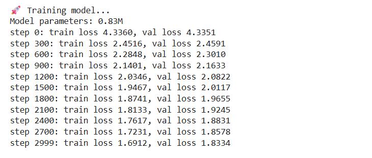
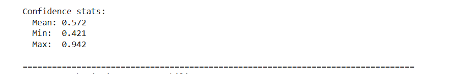
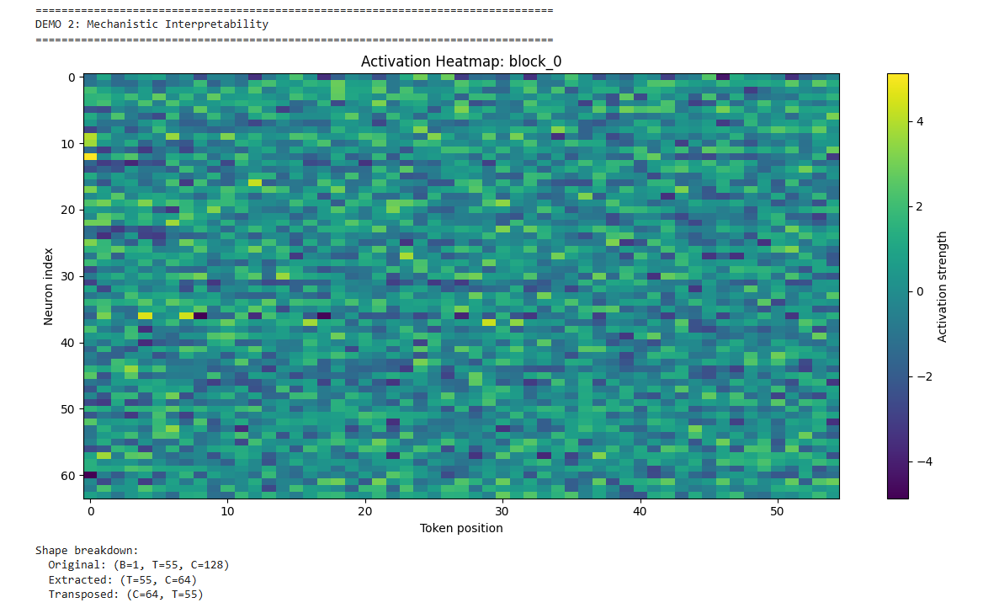
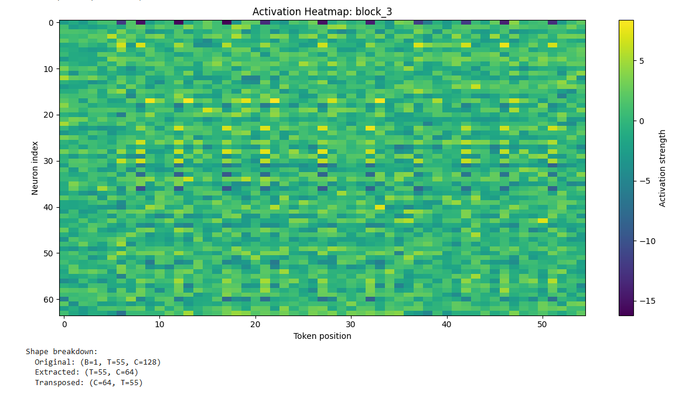
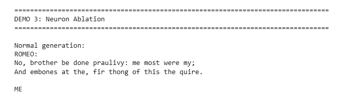
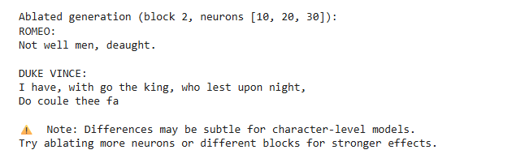

# Self-Diagnosing GPT with Mechanistic Interpretability

[](https://www.python.org/downloads/)
[](https://opensource.org/licenses/MIT)

A **research-grade GPT-from-scratch** that can estimate its own uncertainty, expose internal representations, and support causal neuron ablation for mechanistic interpretability.  
This project is inspired by Andrej Karpathy’s GPT tutorial and extended toward **AI safety, reliability, and interpretability research**.

---

##  Features

- **Self-Diagnosing Architecture**: Dual-head GPT with explicit confidence estimation  
- **Uncertainty Estimation**: Entropy-based, learned confidence (no heuristics)  
- **Mechanistic Interpretability**: Activation logging and neuron × token heatmaps  
- **Neuron Ablation**: Causal intervention framework for internal analysis  

---

##  Architecture
Input Tokens
↓
Token + Positional Embeddings
↓
N × Transformer Blocks
(Self-Attention + MLP)
↓
LayerNorm
↓ ↓
LM Head Confidence Head
Next Token Uncertainty ∈ [0,1]


Both heads are trained jointly using a multi-objective loss, preserving language modeling quality while learning calibrated uncertainty.

---

## 📊 Results & Visualizations

### Training Dynamics


- Training loss decreases steadily (~4.3 → ~1.7)
- Validation loss closely tracks training loss
- Indicates stable optimization without significant overfitting

---

### Confidence Estimation


- Mean confidence ≈ **0.57**
- Minimum confidence ≈ **0.42**
- Maximum confidence ≈ **0.94**

This shows the model is neither overconfident nor random, and can express calibrated uncertainty during generation.

---

### Mechanistic Interpretability: Activation Heatmaps

**Early Transformer Block (Block 0)**  
Diffuse, low-level activations capturing local features.



**Late Transformer Block (Final Block)**  
More structured, token-aligned activations reflecting higher-level representations.



This matches theoretical expectations of hierarchical feature abstraction in Transformers.

---

### Neuron Ablation (Causal Analysis)

**Normal Generation**


**After Neuron Ablation**


Selected MLP neurons are zeroed out during inference, leading to measurable (though subtle) changes in generation.  
This demonstrates **causal influence**, not just correlation.

---

##  Installation

```bash
git clone https://github.com/shivamim/self-diagnosing-gpt.git
cd self-diagnosing-gpt
pip install -e
```

## Documentation

- **Training**: Character-level GPT on Shakespeare dataset
- **Confidence**: Supervised by normalized entropy
- **Interpretability**: Forward hooks on transformer blocks
- **Ablation**: Context manager for neuron zeroing

## Citation
```bibtex
@software{self_diagnosing_gpt2025,
  author = {Shivam Shukla},
  title = {Self-Diagnosing GPT with Mechanistic Interpretability},
  year = {2025},
  url = {https://github.com/shivamim/self-diagnosing-gpt}
}
```

## License

MIT License - see LICENSE file for details.

## Acknowledgments

- Based on Andrej Karpathy's GPT tutorial
